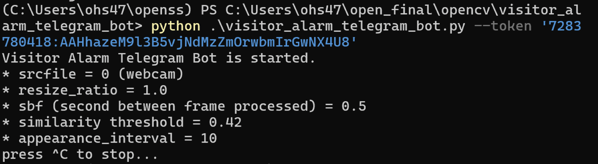
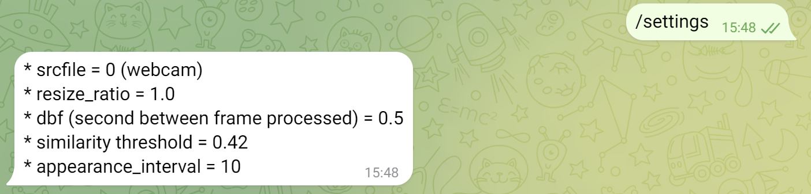
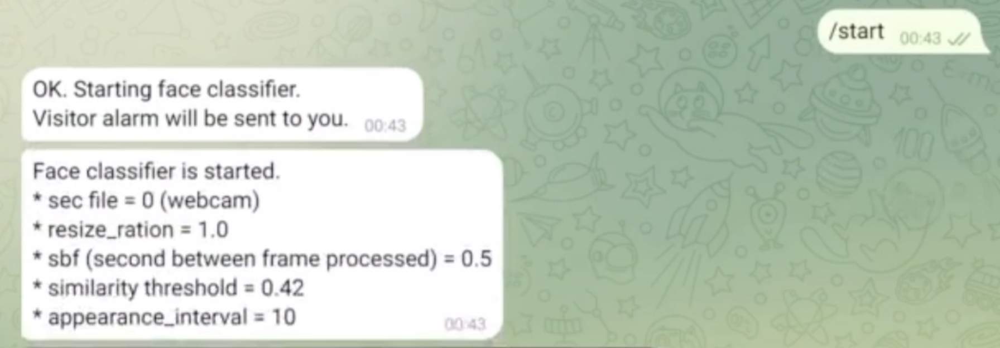
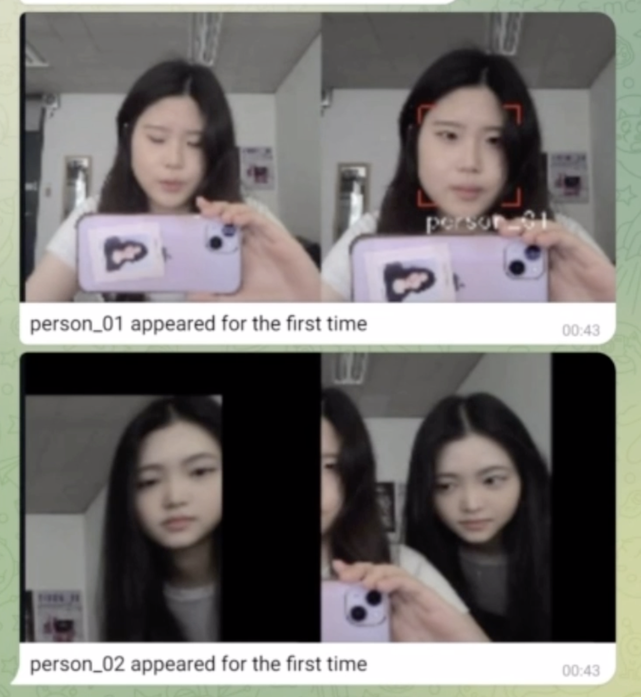
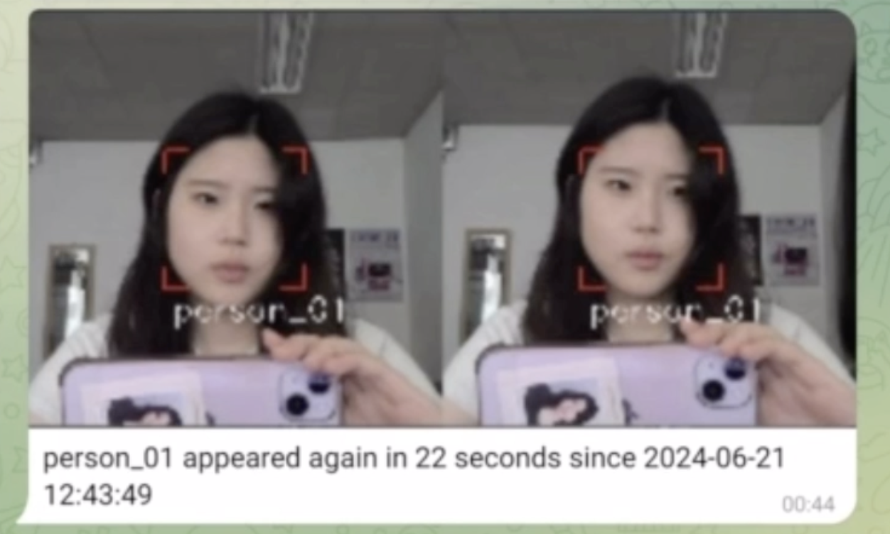
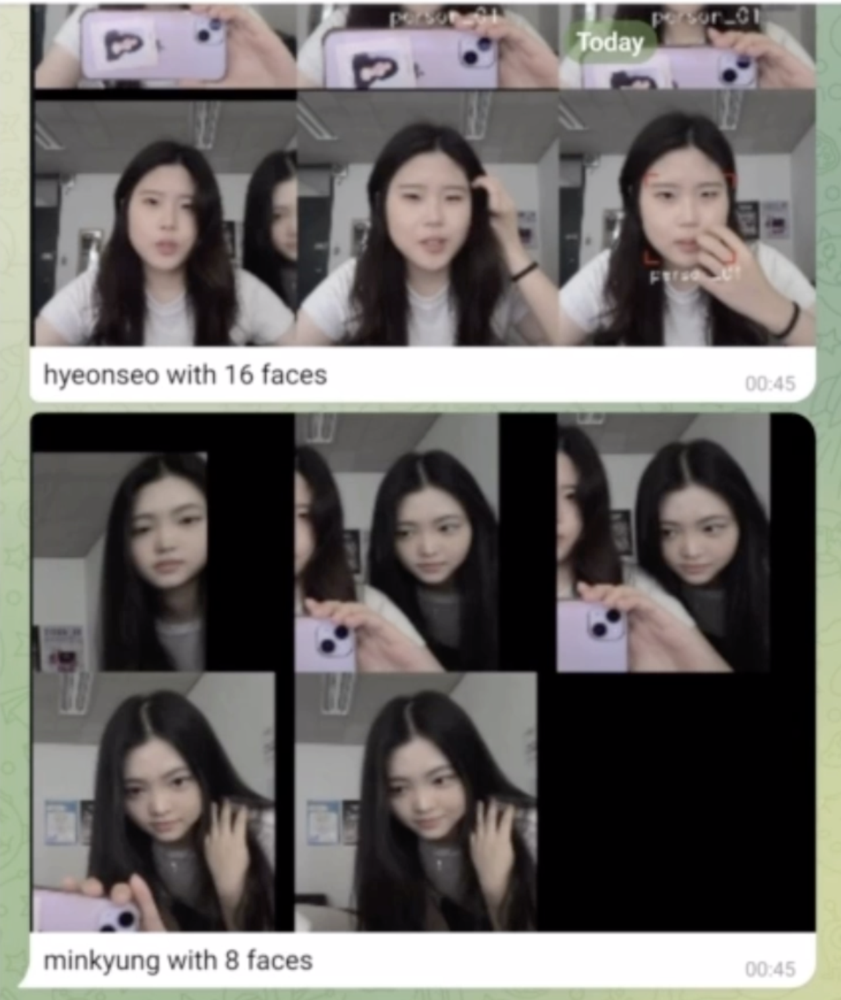

# Visitor Alarm Telegram Bot 소개

텔레그램 봇은 다음 기능들을 수행할 수 있습니다 : 
* web cam에서 (혹은 비디오 파일) 비디오 읽어오기
* 화면에서 얼굴 인식하기
* 이전에 저장된 얼굴들과 인식되는 얼굴 비교
* 새로운 얼굴이 인식되거나 저장된 얼굴이 다시 나타났을 시 or the person appears again, Telegram을 통해 메세지 전달하기

# 사용한 라이브러리

* opencv-python
* opencv-contrib-python
* dlib (CMake 라이브러리 사용)
* face_recognition
* imutils
* python-telegram-bot
* humanize

# 작동 과정

```bash
$ python visitor_alarm_telegram_bot.py -h
usage: visitor_alarm_telegram_bot.py [-h] --token TOKEN [--srcfile SRCFILE]
                                 [--threshold THRESHOLD] [--sbf SBF]
                                 [--resize-ratio RESIZE_RATIO]
                                 [--appearance-interval APPEARANCE_INTERVAL]

optional arguments:
  -h, --help            show this help message and exit
  --token TOKEN         Telegram Bot Token
  --srcfile SRCFILE     Video file to process. If not specified, web cam is
                        used.
  --threshold THRESHOLD
                        threshold of the similarity (default=0.42)
  --sbf SBF             second between frame processed (default=0.5)
  --resize-ratio RESIZE_RATIO
                        resize the frame to process (less time, less accuracy)
  --appearance-interval APPEARANCE_INTERVAL
                        alarm interval second between appearance (default=10)
```

구글을 서치해 Telegram bot을 우선 만들었습니다. 
그 후, visitor_alarm_telegram_bot.py 파일을 토큰으로 파라미터에 주고 실행시켰습니다. (아래 사진 참조)

<p align="center">
   
</p>

Telegram 앱을 핸드폰과 기기에 설치한 후, 봇의 채팅창에 들어가 '/start' 명령어를 사용해 작동시켰습니다.


| 명령어 목록 | 설명 |
|--------------------|----------|
| /help | 명령어 목록 출력 |
| /settings | 현재의 설정 값 출력 |
| /start | face classifier를 구동하여 얼굴 인식과 분류를 시작 |
| /stop | face classifier를 종료 |
| /rename old_name new_name | 인식된 사람의 이름 변경 |
| /list | person DB에 있는 사람의 리스트와 사진을 출력 |

# (결과)채팅 화면 캡쳐

## /settings

webcam과 연결되도록 설정 되어있음을 확인할 수 있습니다. 

<p align="center">
  
</p>

## /start

얼굴 인식이 실행됩니다. 아래와 같이 메세지가 출력됩니다.

<p align="center">
   
</p>

## /start -> 사람 처음 등장

새로운 사람이 인식되었을 떼, 해당 메시지가 사용자에게 전송됩니다. 

<p align="center">
   
</p>

## /start -> 사람 재등장

동일한 사람이 다시 인식 되었을 때, 해당 메시지가 사용자에게 전송됩니다.

<p align="center">
   
</p>

## /rename

인식한 person_01, person0_02에 이름을 설정해두었습니다.

<p align="center">
   
</p>

## /list

인식된 인물들의 리스트를 확인할 수 있습니다.

<p align="center">
   
</p>

# 참고 자료 
[https://ukayzm.github.io/visitor-alarm-telegram-bot/](https://ukayzm.github.io/visitor-alarm-telegram-bot/)

